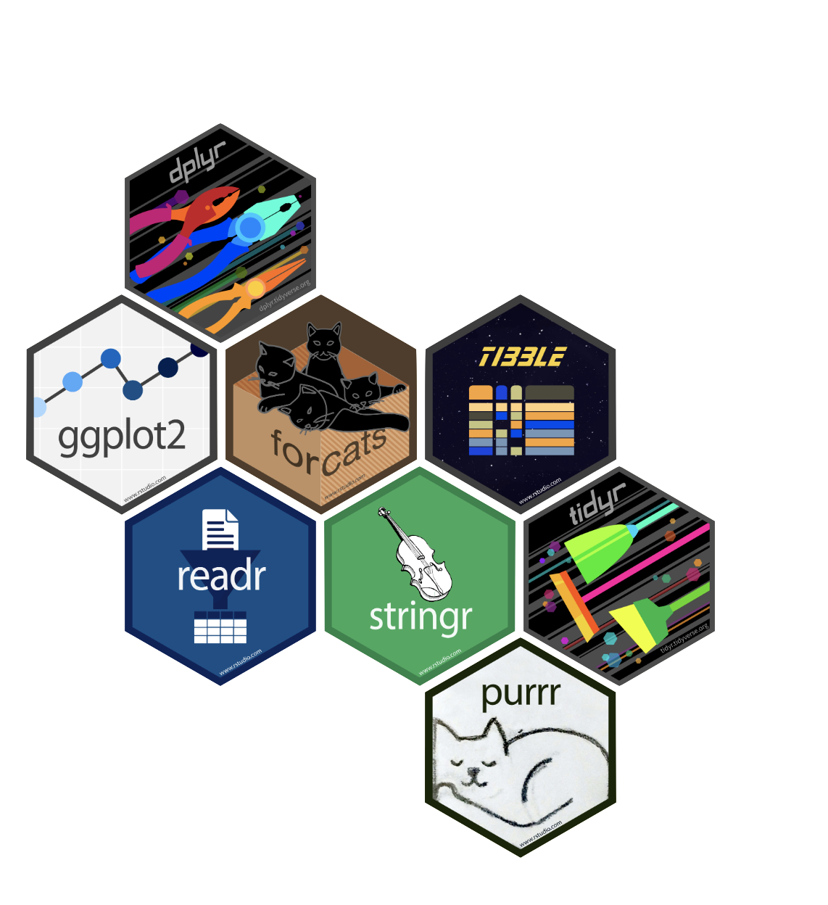

# Baltimore Girls Who Code Drop-in 

Some source code and resources for hanging out with Baltimore's GWC chapter in April 2022! An introduction to data science and statistical thinking.

### Exercise

> My cousin is getting married in Kansas City in May and I need to book flights from Baltimore to Kansas City. I want to decide which airline to pick, which weekday to depart, and what time of day to leave so that the chances of my flight being cancelled or delayed are the smallest. Which airline should I pick, which day of the week should I depart on, and around when during the day should I depart?

Source code:

* [Download the data](https://github.com/simonpcouch/gwc-bmore-2022/blob/master/source/grad_data.md)
* Analyze it

### People I work with + admire

People practice data science in a _lot_ of different ways using all sorts of different tools. Here are some friends and coworkers that I look up to:

* [Silvia Canelón](https://www.silviacanelon.com/): "I am researcher, community organizer, and R educator. My research leverages electronic health record data to study pregnancy-related outcomes."
* [Mine Çetinkaya-Rundel](https://mine-cr.com/): Her work "focuses on innovation in statistics and data science pedagogy, with an emphasis on computing, reproducible research, student-centered learning, and open-source education."
* [Ijeamaka Anyene](https://ijeamaka.art/portfolio/): "I am a full-time healthcare data analyst... [and] freelance computational artist. Using code (mainly the R programming language), I create data art and generative art systems."
* [Julia Silge](https://juliasilge.com/): "I'm a tool builder, author, international keynote speaker, and real-world practitioner focusing on data analysis and machine learning."
* [Alison Hill](https://www.apreshill.com/): "I work on creating online experiences to bring machine learning and artificial intelligence (AI) problems and solutions to life."
* [Hannah Frick](https://www.frick.ws/): Software engineer on the tidymodels team, PhD in Statistics, and co-founder of [R-Ladies](https://rladies.org/).
* [Jenny Bryan](https://jennybryan.org/): "We develop open source  packages to make data science faster, easier and more fun."

### Resources for learning about data science

> No one is born a data scientist. Every person who works with R today was once a complete beginner. No matter how much you know about the R ecosystem already, you’ll always have more to learn. - [RStudio Education Blog](https://education.rstudio.com/)

* [Learning R](https://education.rstudio.com/learn/): Some more extensive + customizable resources for learning R.
* [R-Ladies](https://rladies.org/): "A world-wide organization to promote gender diversity in the R community."
* [R-Ladies Baltimore](https://rladies-baltimore.github.io/): Baltimore's R-Ladies chapter!
* [A Primer on Statistics](https://tinystats.github.io/teacups-giraffes-and-statistics/index.html): A more statistics / math-focused series on thinking with data
* [How R Data Scientists Use Git + GitHub](https://happygitwithr.com/): More about the intersection of R and Git.
* [Me](https://twitter.com/simonpcouch): My twitter feed!
* [What I Work On](https://blog.simonpcouch.com/): My blog, where I write my software and what I think about when I'm working on it.

### A cool first project

I've heard yall know a good bit about Git and GitHub. One project that could be a good way to use the skills you already have while learning a bit of R would be to _make your own personal website_!

Once you've got RStudio set up and have worked through a tutorial or two, try working through Alison Hill's [tutorial on setting up a website with R](https://www.apreshill.com/blog/2020-12-new-year-new-blogdown/).

