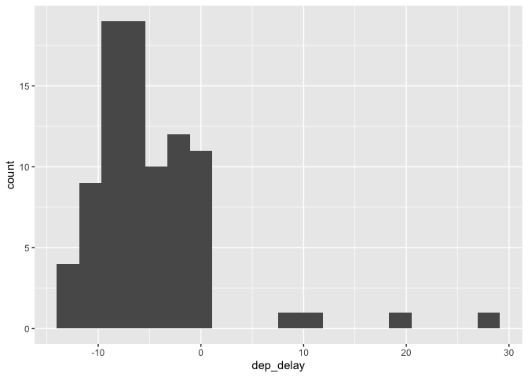
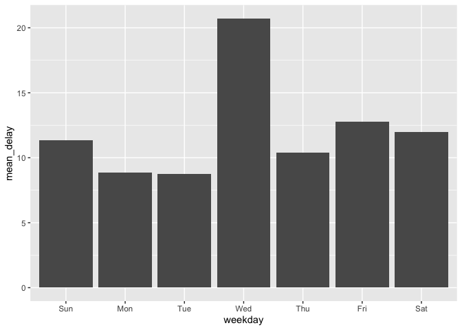

# Analyzing the flights data

> My cousin is getting married in Kansas City in May and I need to book
> flights from Baltimore to Kansas City. I want to decide which airline
> to pick, which weekday to depart, and what time of day to leave so
> that so that the I have the least chance of my plane being delayed.
> Which airline should I pick, which day of the week should I depart on,
> and around when during the day should I depart?

Now that we’ve [downloaded the
data](https://github.com/simonpcouch/gwc-bmore-2022/blob/master/source/grad_data.md),
we can analyze it to get at these questions.

First loading the packages I’ll need,

``` r
# general tools to work with data
library(tidyverse)
library(lubridate)
```

Now, loading the data,

``` r
load("source/flights.Rda")
```

Taking a glimpse at the data,

``` r
# take a look by column
glimpse(flights)
```

    ## Rows: 6,396
    ## Columns: 19
    ## $ year           <int> 2021, 2021, 2021, 2021, 2021, 2021, 2021, 2021, 2021, 2…
    ## $ month          <int> 5, 5, 5, 5, 5, 5, 5, 5, 5, 5, 5, 5, 5, 5, 5, 5, 5, 5, 5…
    ## $ day            <int> 1, 1, 1, 1, 1, 1, 1, 1, 1, 1, 1, 1, 1, 1, 1, 1, 1, 1, 1…
    ## $ dep_time       <int> 527, 533, 557, 608, 610, 611, 624, 627, 628, 633, 634, …
    ## $ sched_dep_time <int> 530, 535, 600, 610, 606, 615, 630, 625, 625, 635, 635, …
    ## $ dep_delay      <dbl> -3, -2, -3, -2, 4, -4, -6, 2, 3, -2, -1, -3, 5, -7, -4,…
    ## $ arr_time       <int> 750, 714, 722, 701, 733, 833, 901, 822, 814, 753, 844, …
    ## $ sched_arr_time <int> 806, 726, 729, 705, 749, 850, 915, 840, 825, 805, 915, …
    ## $ arr_delay      <dbl> -16, -12, -7, -4, -16, -17, -14, -18, -11, -12, -31, -1…
    ## $ carrier        <chr> "AA", "DL", "DL", "WN", "AA", "WN", "F9", "WN", "WN", "…
    ## $ flight         <int> 213, 396, 307, 366, 452, 391, 478, 382, 761, 367, 377, …
    ## $ tailnum        <chr> "N906NN", "N806DN", "N349NB", "N752SW", "N923AN", "N868…
    ## $ origin         <chr> "BWI", "BWI", "BWI", "BWI", "BWI", "BWI", "BWI", "BWI",…
    ## $ dest           <chr> "MIA", "ATL", "DTW", "BNA", "CLT", "RSW", "MIA", "LAS",…
    ## $ air_time       <dbl> 125, 84, 68, 89, 63, 127, 129, 278, 86, 66, 118, 99, 98…
    ## $ distance       <dbl> 946, 577, 409, 587, 361, 919, 946, 2106, 577, 369, 925,…
    ## $ hour           <dbl> 5, 5, 6, 6, 6, 6, 6, 6, 6, 6, 6, 6, 6, 7, 7, 7, 7, 7, 7…
    ## $ minute         <dbl> 30, 35, 0, 10, 6, 15, 30, 25, 25, 35, 35, 50, 45, 0, 0,…
    ## $ time_hour      <dttm> 2021-05-01 05:00:00, 2021-05-01 05:00:00, 2021-05-01 0…

``` r
# take a look by rows
head(flights)
```

    ## # A tibble: 6 × 19
    ##    year month   day dep_time sched_dep_time dep_delay arr_time sched_arr_time
    ##   <int> <int> <int>    <int>          <int>     <dbl>    <int>          <int>
    ## 1  2021     5     1      527            530        -3      750            806
    ## 2  2021     5     1      533            535        -2      714            726
    ## 3  2021     5     1      557            600        -3      722            729
    ## 4  2021     5     1      608            610        -2      701            705
    ## 5  2021     5     1      610            606         4      733            749
    ## 6  2021     5     1      611            615        -4      833            850
    ## # … with 11 more variables: arr_delay <dbl>, carrier <chr>, flight <int>,
    ## #   tailnum <chr>, origin <chr>, dest <chr>, air_time <dbl>, distance <dbl>,
    ## #   hour <dbl>, minute <dbl>, time_hour <dttm>

Each row is a flight that left BWI (note: we don’t have cancelled ones),
and each column is some piece of information about that flights
departure: time, date, departure delay, destination, etc.

### Which airline should I pick?

Note that there’s a column in our data called `carrier`–that’s our
airline.

``` r
head(flights$carrier)
```

    ## [1] "AA" "DL" "DL" "WN" "AA" "WN"

There’s also a column called `dep_delay` that gives us our departure
delay for a given flight.

``` r
head(flights$dep_delay)
```

    ## [1] -3 -2 -3 -2  4 -4

We’ll use some tools from the tidyverse to group by the airline and then
take the average flight delay `dep_delay` for that airline. Then, we can
visualize our results.

``` r
mean_delay_by_carrier <-
  flights %>%
    group_by(carrier) %>%
    summarize(mean_delay = mean(dep_delay, na.rm = TRUE),
              n = n()) %>%
  arrange(mean_delay)

mean_delay_by_carrier
```

    ## # A tibble: 13 × 3
    ##    carrier mean_delay     n
    ##    <chr>        <dbl> <int>
    ##  1 UA          -5.05     88
    ##  2 OH          -2.31     36
    ##  3 9E          -0.559    59
    ##  4 YX          -0.524    82
    ##  5 F9           0.357    84
    ##  6 AS           1.77     31
    ##  7 OO           3.08     25
    ##  8 YV           3.34     62
    ##  9 NK           5.30    490
    ## 10 DL           6.61    351
    ## 11 G4           9.32     39
    ## 12 AA          10.1     321
    ## 13 WN          14.4    4728

Okay—so, maybe I should pick United Air Lines! This is just an average,
though—how much variation is there in departure delay?

``` r
flights %>%
  filter(carrier == "UA") %>%
  ggplot() +
    geom_histogram(bins = 20) +
    aes(x = dep_delay)
```

<!-- -->

Looks like, most of the time, United Air Lines flights left just before
the scheduled time or right on time. When they left late, though, they
left *late*.

### Which day of the week should I depart on?

This one’s a bit tricky. In this data, we have the date that each flight
leaves one, but we’ll have to match that up with a calendar to get the
weekday.

``` r
flights <- flights %>%
  # make the `weekday` column
  mutate(weekday = wday(time_hour, label = TRUE))

head(flights$weekday)
```

    ## [1] Sat Sat Sat Sat Sat Sat
    ## Levels: Sun < Mon < Tue < Wed < Thu < Fri < Sat

Now that we have the weekday, this problem looks a lot like the one
above,

``` r
mean_delay_by_weekday <-
  flights %>%
    group_by(weekday) %>%
    summarize(mean_delay = mean(dep_delay, na.rm = TRUE),
              n = n()) %>%
  arrange(mean_delay)

mean_delay_by_weekday
```

    ## # A tibble: 7 × 3
    ##   weekday mean_delay     n
    ##   <ord>        <dbl> <int>
    ## 1 Tue           8.76   780
    ## 2 Mon           8.84  1093
    ## 3 Thu          10.4    874
    ## 4 Sun          11.3   1086
    ## 5 Sat          12.0    898
    ## 6 Fri          12.8    873
    ## 7 Wed          20.7    792

Visualizing these results,

``` r
mean_delay_by_weekday %>%
  ggplot() +
  aes(x = weekday, y = mean_delay) +
  geom_col()
```

<!-- -->

Maybe Tuesday is the day to head out!

### Around when during the day should I depart?

``` r
mean_delay_by_tod <-
  flights %>%
    mutate(tod = case_when(
      hour >= 1 & hour <= 6 ~ "early morning",
      hour >= 7 & hour <= 12 ~ "morning",
      hour >= 13 & hour <= 18 ~ "afternoon",
      hour >= 19 & hour <= 24 ~ "evening",
    )) %>%
    group_by(tod) %>%
    summarize(mean_delay = mean(dep_delay, na.rm = TRUE),
              n = n()) %>%
  arrange(mean_delay)

mean_delay_by_tod
```

    ## # A tibble: 4 × 3
    ##   tod           mean_delay     n
    ##   <chr>              <dbl> <int>
    ## 1 early morning       2.86   520
    ## 2 morning             5.77  2389
    ## 3 afternoon          13.8   2053
    ## 4 evening            22.8   1434

Oh, interesting! The later in the day a flight leaves, the more likely
it is to be delayed. Makes sense, I guess? Airlines can troubleshoot
issues overnight and then have a “blank slate” each morning.

### Concluding thoughts

We’ve used data to help us inform our decision on which flights to take
out of BWI. What things might influence how correct our analysis is?

Some possibilities:

-   I looked at airline, weekday, and time of day *separately*. Do these
    things relate to each other in their influence on departure delays?
    That is, does the time of day matter more for delays on a weekday
    than a weekend? Are some airlines better at overnight flights than
    others?
-   Delays might be caused by different factors in 2021 than in 2022.
    Supply chain issues, the financial wellness of different airlines,
    etc.
-   I assumed that a flight occurring in May was a more important
    similarity than a flight being recent. Should I have used the most
    recent data possible?
-   I only looked at flights that *left BWI*, and did not also require
    that the flight *arrived in Kansas City*. Maybe certain airlines are
    better at flying to certain places!
-   We didn’t consider flights that were cancelled, as they weren’t
    included in the day. Maybe it’s better for a flight to be delayed
    than cancelled, and delays mean reselience to cancellation!
